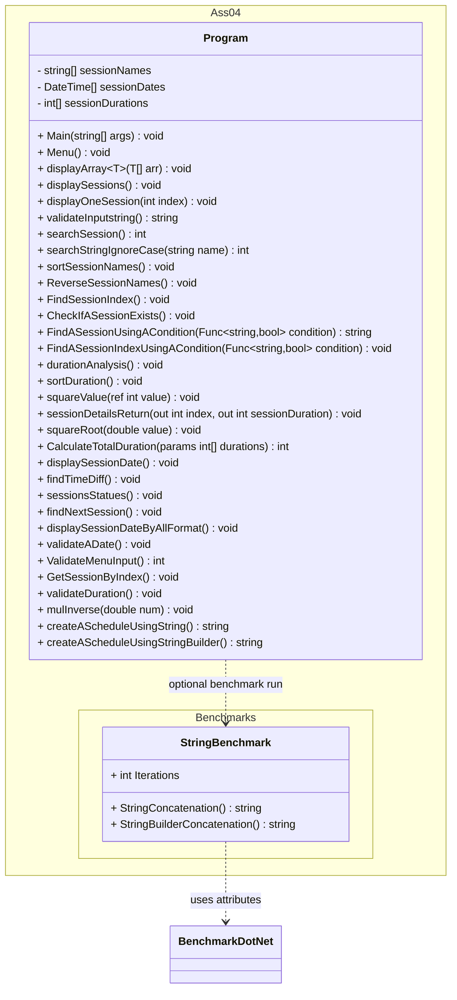
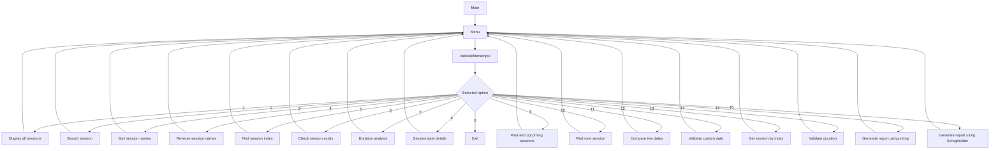
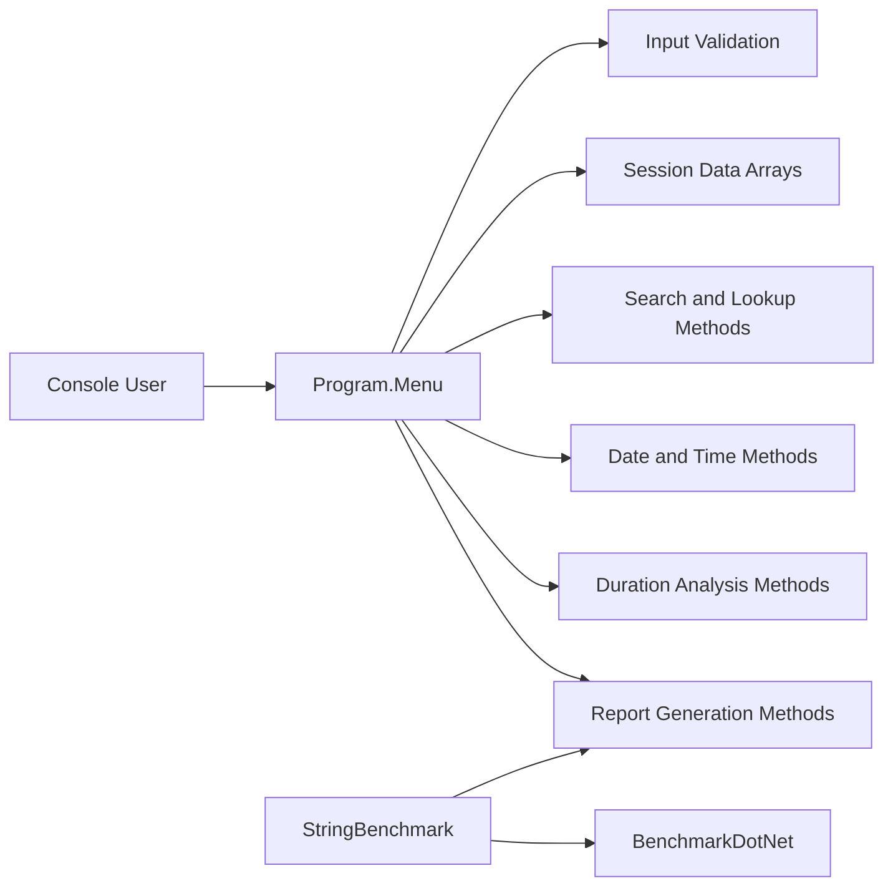

# UML Diagram - Academy Schedule Analyzer

Open this file in Visual Studio Code and use Markdown Preview (`Ctrl+Shift+V`) to view the diagrams.

## Class Diagram

## Application Flow Diagram

## Component Diagram

